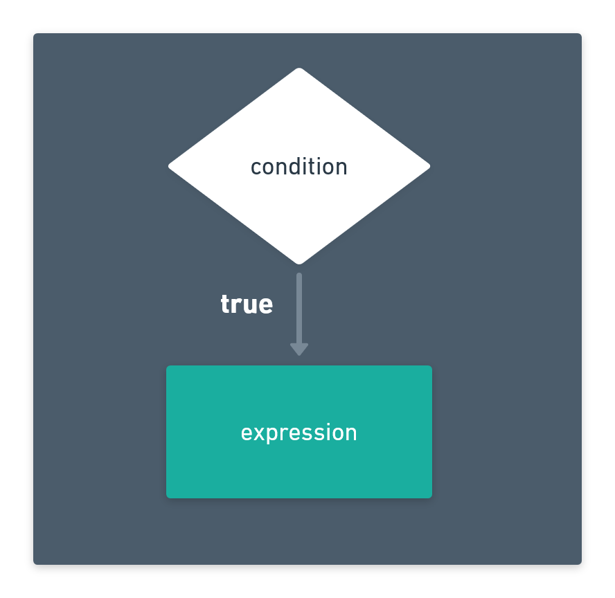
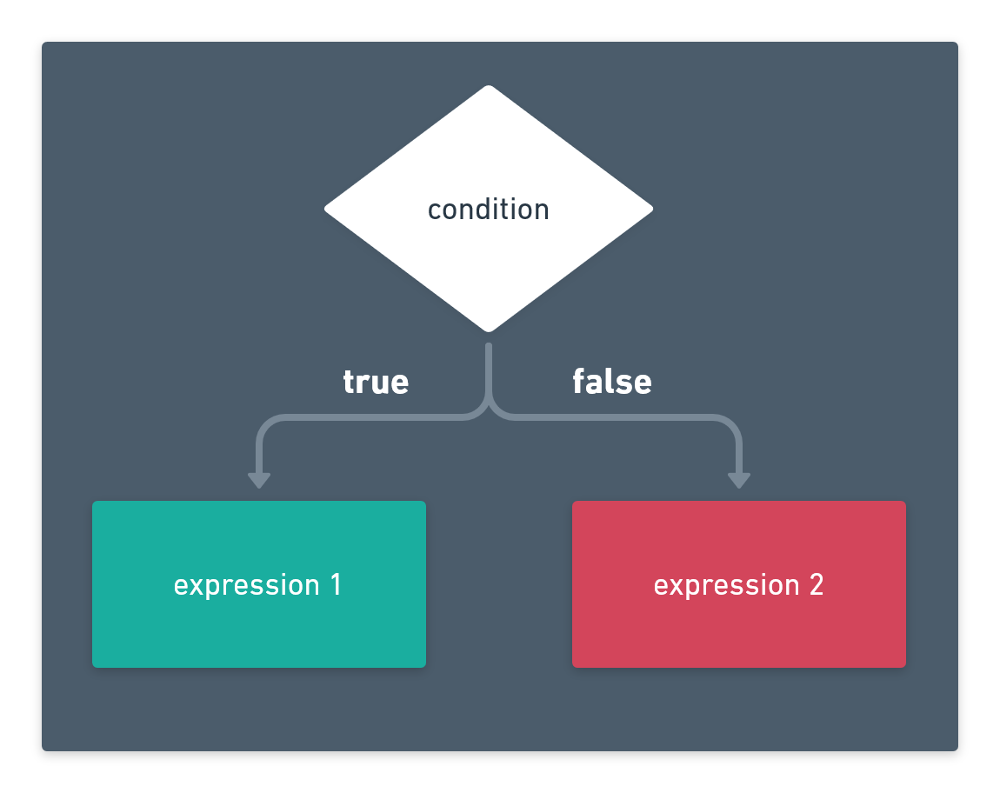
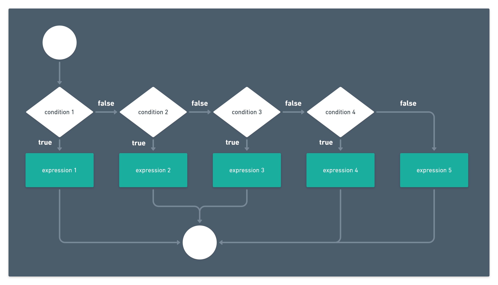

## Table of Contents

##

Les structures de contrôle en programmation permettent de contrôler le
flux d'exécution d'un programme. En effet, il existe plusieurs structures de contrôle.

- Les structures conditionnelles
- Les Boucles
- Break et Continue
- La structure Switch

Dans les prochains tutoriels , nous explorerons chacun de ces concepts.

## Les structures conditionnelles

Dans un programme, il peut arriver que nous souhaitions modifier le comportement d'une opération en fonction d’une condition. Pour cela nous utilisons les conditions. Les conditions permettent d'écrire dans le programme des portions de code qui s' exécutent si une condition est remplie ou d' exécuter une autre portion si elle ne l'est pas.

Dans la programmation en général et dans le langage Dart en particulier, il existe plusieurs structures conditionnelles.

- If (si) ou Structure conditionnelle simple
- If....else (si .... sinon) ou Structure conditionnelle alternative
- If...else...if (si .... sinon .... si) ou structure conditionnelle généralisée

## IF (SI)

On parle de Structure conditionnelle simple lorsque le traitement du programme dépend d’une seule condition. Quand cette condition est vraie le code s'exécute. Les conditions sont créées grâce aux opérateurs dont nous avons discuté dans les tutoriels précédents.



Quand le programme arrive au niveau de la condition **if**, la condition est évaluée. Si cette évaluation retourne **true** l'expression est exécutée. Si la condition est fausse (retourne **false**) le programme continue son exécution sans exécuter l'expression dans la condition **if**.

Syntaxe pour créer une condition simple avec **if**

```dart
if(condition){
    expression;
}
```

Exemple

```dart
double moyenne = 14.56;
if(moyenne >= 10){
    print("Réussi");
}
print("continuons ...");

//output
//	Reussi
//	continuons ...
```

Dans ce cas, la condition est vraie ( **14.56 est supérieur ou égal à 10** ) donc le programme exécute l'expression **print("Réussi")**. Ensuite l' exécution du programme continue et l'expression **print("continuons ...")** est exécutée.

## IF .... ELSE (SI .... SINON)

On parle de Structure conditionnelle alternative lorsque le traitement du programme dépend d’une aussi seule condition comme la structure conditionnelle simple **IF**. Mais dans ce cas, si la condition est vraie, la première expression est exécutée; si la condition est fausse, la deuxième expression est exécutée et l' exécution du programme continue.



Quand le programme arrive au niveau de la condition **if .... else**, la condition est évaluée. Si cette évaluation retourne **true** l'expression 1 est exécutée. Si la condition est fausse (retourne **false**) l'expression 2 est exécutée.

Syntaxe pour créer une condition alternative avec **if .... else**

```dart
if(condition){
    expression 1;
}else {
    expression 2;
}
```

Exemple

```dart
int nombre = 13;
if(nombre % 2 == 0){
    print("$nombre est paire");
}else {
    print("$nombre est impaire");
}
print("fin du programme");

//Output
//13 est impaire
//fin du programme
```

Le programme ci-dessus évalue un nombre et dit si il est pair ou impair. Par définition un nombre est pair si sa division par 2 donne un reste égal à 0. Pour cela la condition calcule le modulo du nombre. Si le résultat de cette opération est égal à 0 (le reste de la division est égal à 0) la condition est vérifiée; ce qui veut dire que ce nombre est pair sinon le nombre est impair.

## IF...ELSE..IF (SI .... SINON .... SI)

On parle de Structure conditionnelle généralisée lorsqu'elle permet de lier des instructions à des conditions **variables** et **finies**. Cette structure permet de faire plusieurs évaluations de condition à la suite et exécute une certaine expression quand une seule de ces conditions est vraie.



Quand l'expression de la condition vraie est exécutée, le programme quitte la structure conditionnelle et continue son exécution.

Il est possible d' évaluer le nombre de conditions voulues

Syntaxe pour créer une condition généralisée avec **if .... else .... if**

```dart
if(condition 1){
    expression 1
}else if(condition 1){
    expression 1;
}else if(condition 2){
    expression 2;
}else if(condition 3){
    expression 3;
}else {
    expression 4;
}
```

Exemple

```dart
double moyenne = 14.56;
String mention;

if (moyenne >= 10 && moyenne < 12) {
    mention = 'Passable';
} else if (moyenne >= 12 && moyenne < 14) {
    mention = 'Assez bien';
} else if (moyenne >= 14 && moyenne < 16) {
    mention = 'Bien';
} else if (moyenne >= 16 && moyenne < 18) {
    mention = 'Très bien';
} else if (moyenne >= 18 && moyenne <= 20) {
    mention = 'Execellent';
} else {
    mention = 'Ajournee';
}

print("Avec une moyenne de $moyenne, votre mention est $mention");

//Output
//Avec une moyenne de 14.56, votre mention est Bien
```

Dans ce cas, toutes les évaluations de la moyenne sont faites et quand une d'entre elles est vraie l'expression qui lui est associée est exécutée sinon l'expression dans la branche **else (sinon)** est exécutée.

## Plus sur les structures conditionnelles

Il est possible de faire encore plus de manipulation avec les structures conditionnelles.

Par exemple il est possible d' **imbriquer les structures conditionnelles**.

Exemple

```dart
double taille = 1.80;

if (taille >= 1.70) {
    print("Vous etes accepté");
    if (taille == 1.80) {
      print("Wouaoh 😲!!! votre taille est de 1.80 m");
    }
} else {
    print("Vous n'êtes pas accepté");
}

//Output
//Vous êtes accepté
//Wouaoh 😲!!! votre taille est de 1.80 m
```

Il est aussi possible d' écrire une condition **if .... else** en une seule ligne. Cela se fait avec un **opérateur ternaire** précédemment étudié.

```dart
double taille = 1.80;
String resultat = (taille >= 1.70) ?
      "Vous etes accepté" : "Vous n'êtes pas accepté";
print(resultat);

//Output
//Vous etes accepté
```

---

## Pratique

Evaluation du maximum entre deux nombres

```dart:title=max.dart
main() {
  int x = 123;
  int y = 321;
  int max;

  if (x > y) {
    max = x;
  } else if (x == y) {
    max = x;
  } else {
    max = y;
  }
  print("le maximum entre $x et $y est $max");
}
```

ou

```dart:title=max.dart
main() {
  int x = 123;
  int y = 321;
  int max;
  if (x == y) {
    max = x;
  } else {
    max = (x > y) ? x : y;
  }

  print("le maximum entre $x et $y est $max");
}
```

```:title=output
le maximum entre 123 et 321 est 321
```

Un programme qui calcule les solutions d'une équation du second degré (**ax² + bx + c** )

```dart:title=equation.dart
import 'dart:math' as Math;

main() {
  //equation x² + 5x + 4
  var a = 1;
  var b = 5;
  var c = 4;

  print("equation : ${a==1 ? "" : a}x² + ${b}x + $c");

  double resultat = b * b - 4.0 * a * c;

  if (resultat > 0.0) {
    double r1 = (-b + Math.pow(resultat, 0.5)) / (2.0 * a);
    double r2 = (-b - Math.pow(resultat, 0.5)) / (2.0 * a);

    print("Les solutions sont ${r1} et ${r2}");

  } else if (resultat == 0.0) {
    double r1 = -b / (2.0 * a);
    print("La solution est " + r1.toString());

  } else {
    print("l'equation n'a pas de solution reelle.");
  }
}

```

Dans cet exemple nous utilisons la méthode **Math.pow** de la librairie intégrée math de Dart qui prend en paramètre une valeur et l'exposant auquel on souhaiterait l'élever et retourne le résultat du calcul.

> Nous parlerons des librairies intégrées de Dart dans une autre section.

```:title=output
equation : x² + 5x + 4
Les solutions sont -1.0 et -4.0
```
