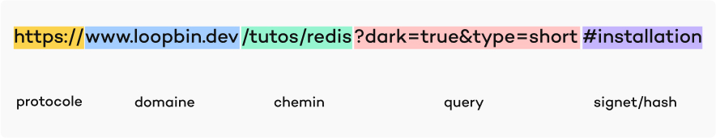

## Table of Contents

Dans ce petit tuto nous allons explorer la notion d’URL, qu’est-ce que s’est et ces différentes parties.

Si il y a une chose que nous utilisons tout le temps dans nos navigateur se sont les urls. Nous connaissons certains même par cœur comme **`google.com`** , **`facebook.com`**. Mais qu’est-ce que c'est qu’une url ?

NB: il existe plusieurs types d’URL. Nous allons seulement nous concentrer sur les URL web comme

```
https://www.loopbin.dev/tutos/redis?dark=true&type=short#installation
```

## Definition

URL est un sigle anglais qui signifie Uniform Resource Locator ou localisateur uniforme de ressource. Bref c’est une concaténation où une chaîne de caractère suivant des règles ou convention et qui nous permet d’accéder à des ressources ou des points sur le web.

par exemple **`https://web.whatsapp.com`** nous permet d’accéder à la page web de WhatsApp.

Sur un site web quelconque l’URL est appelé à changer plusieurs fois pour nous pointer vers la ressource appropriée.

Nos applications utilisent aussi des urls pour recevoir des informations. Par exemple, l’application Instagram utilise un ensemble d’URL pour recevoir les postes , les profils ainsi que d'autres informations qui permettent à l’application de fonctionner correctement.

## Les différentes parties d’une url



Comme nous l’avons précédemment dit, une url est un ensemble de caractères suivant un format et une convention. Ceci oblige une url valide à avoir différentes parties.

- Le protocole (https ou http): c'est le protocole de communication avec le serveur web. De nos jours, il n’est pas obligatoire dans un navigateur. Ceux-ci sont assez intelligents pour les ajouter.
- Le nom de domaine (**`https://www.loopbin.dev`** ou **`https://loopbin.dev`**) : c’est une chaîne de caractères qui pointe vers l’adresse IP du serveur web. Il est aussi possible de passer l’adresse ip à la place du nom de domaine. Le catch est que l’adresse ip est un peu plus difficile à se rappeler.

- Le chemin : permet d' accéder à une ressource précise sur le serveur . Dans ce cas nous pointons vers le tuto sur redis:

- Les données supplémentaires : bien sûr que les informations précédentes sont amplement suffisantes pour vous envoyer vers la page que vous désirez mais il est possible d’ajouter des informations supplémentaires à l’URL. Ces données sont notamment :

  - Les données de requête : des chaînes de caractère reçues et traitées par le serveur. Ils sont appelés les query ou paramètres d’une requête . Cette chaîne de caractère est séparée de la partie principale de l’URL par le symbole **?** et concerner entre eux par le symbole **&**. Elles suivent un format **clé/valeur**. Par exemple **dark=true**. La clé est dark et la valeur est true

  - Le signet/hash/fragment : elle pointe vers une partie de la page web. Par exemple, dans un article, elles permettent de diriger le lecteur vers une section données. Elle est séparé de la partie précédente de l’URL par le symbole **#**.

    Exemple: #installation dirigera le client vers la partie du code html avec le I’id installation

```html
<h2 id="installation">Installation de Redis</h2>
```

## En plus

De nos jours, avec l’adoption des smartphones, il existe d'autres types d’URL utilisés dans le domaine du web.

C’est l’exemple de **`mailto:corneilleayao@gmail.com`** qui demande au navigateur d'ouvrir le client mail et de commencer à composer un mail avec l’adresse du destinataire étant corneilleayao@gmail.com.

D’autres urls permettent d’ouvrir l’application de messagerie , de téléphone et encore plus.
