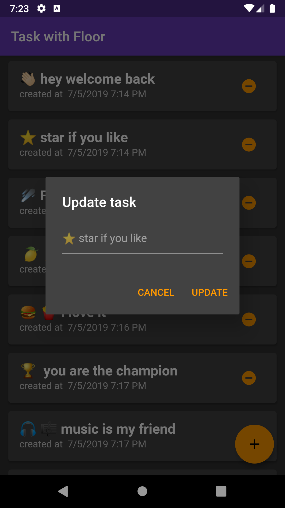

## Table of Contents

##

import Button from '~/components/Button.vue'

<Button isGithub="true" text="Floor task sur Github" link="https://github.com/CorneilleEdi/floor_task"/>

Application de note avec sauvegarde dans une base de données SQlite grâce au package Floor (La branche Provider utilise le package Provider pour la gestion des états).
Le packae Floor est une extension du package SQFlite de Flutter.

<Button isPackage="true" text="Package Floor" link="https://pub.dev/packages/floor"/>

La bibliothèque Floor fournit un code SQL léger avec une abstraction et un mappage automatique entre les objets en mémoire et les lignes de la base de données, tout en offrant un contrôle total de la base de données à l'aide de SQL.

Il est important de noter que cette bibliothèque n'est pas un ORM complet comme Hibernate et ne le sera jamais. Donc, c'est intentionnel.

## Les fonctionalitées:

- Lister toutes les notes
- Ajouter une note
- Editer un note
- Supprimer un note
- Supprimer toutes les notes

## Captures d'écrans

|           Liste            | Dialogue pour ajouter une note | Dialogue pour editer une note |
| :------------------------: | :----------------------------: | :---------------------------: |
|  |       |   |

```dart:title=task.dart
@entity
class Task {
  @PrimaryKey(autoGenerate: true)
  final int id;

  String title;

  final int createdTime;
}
```

Ce code défini le model de la table **Task** dans la base de données

```dart:title=task_dao.dart

@dao
abstract class TaskDao {
  @Query('SELECT * FROM task WHERE id = :id')
  Future<Task> findTaskById(int id);

  @Query('SELECT * FROM task')
  Future<List<Task>> findAllTasks();

  @Query('SELECT * FROM task')
  Stream<List<Task>> findAllTasksAsStream();

  @insert
  Future<void> insertTask(Task task);

  @update
  Future<void> updateTask(Task task);

  @delete
  Future<void> deleteTask(Task task);

  @Query('DELETE FROM task')
  Future<void> deleteAllTask();
}

```
