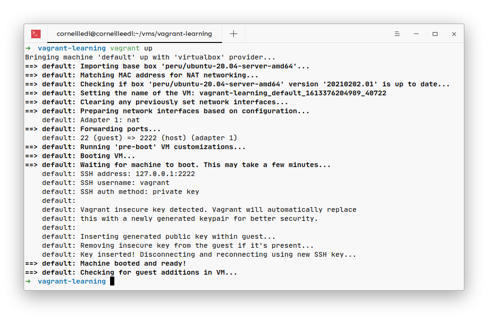
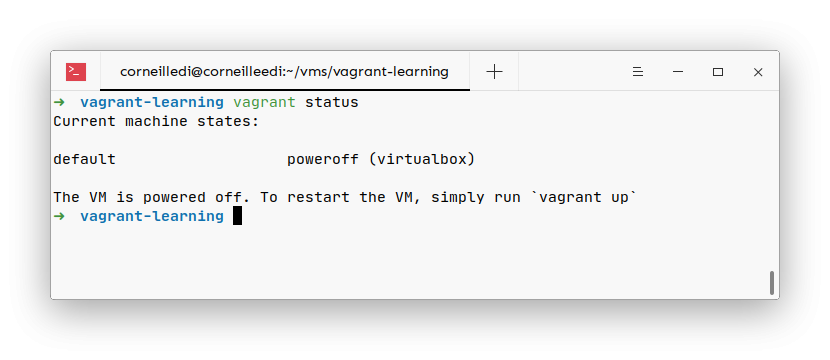

## Table of Contents

##

Nous allons dans cette partie écrire un fichier Vagrantfile très simple et lancer notre premier VM.

Nous profiterons de l'occasion pour explorer quelques commandes très très importantes avec vagrant.

> Si vous n'êtes pas dans le dossier contenant votre vagrantfile, vous pouvez préciser le nom ou l'identifiant de la machine sur laquelle vous aimeriez appliquer la commande.

## Vagrantfile

Pour la création du fichier

```bash
vagrant init
```

Cette commande créera un fichier standard contenant des exemples de configuration que vous pouvez utiliser.

Vous pouvez aussi spécifier des configuration à la création du fichier pour aller plus rapidement comme le nom de l'image.

```bash
vagrant init hashicorp/bionic64
```

L'option -m supprimera toutes les configurations commentées dans le fichier créé

Ou tout simplement

```bash
touch Vagrantfile
```

Il est préférable de mettre ce fichier dans un dossier spécial car Vagrant génère d'autres fichiers dans le même dossier.

## Configuration

Un Vagrantfile simple ressemblera à

```ruby
Vagrant.configure("2") do |config|
    config.vm.box = "peru/ubuntu-20.04-server-amd64"
end
```

La première ligne précise la version du fichier vagrant (2 dans ce cas) et expose une variable config que nous utiliserons pour la description de notre configuration.

```ruby
Vagrant.configure("2") do |config|
```

Vu que **config** n'est qu'une variable, vous pouvez bien sûr la changer.

La deuxième ligne spécifie le nom de l'image à utiliser pour créer notre machine.

```ruby
config.vm.box = "peru/ubuntu-20.04-server-amd64"
```

Si l'image n'existe pas sur votre machine, Vagrant se chargera de la télécharger pour vous.

## Validation du fichier Vagrantfile

```bash
vagrant validate
```

Cette commande vous dira si le fichier Vagrantfile qui se trouve dans le dossier avec est valide ou pas. Elle soulignera les erreurs au cas contraire.

## Lancement

pour lancer notre machine virtuelle nous allons utiliser la commande up dans le dossier ou se trouve notre Vagrantfile.

```bash
vagrant up
```

Resultat



Par defaut:

- Vagrant lancera une fenêtre VirtualBox avec votre vm et vous demandera les informations de connexion qui sont **vagrant** pour le nom et **vagrant** pour le mot de passe.
- Le nombre de processeur de la machine sera à la moitié de celle de votre propre machine
- La capacité de la mémoire RAM sera à la moitié de celle de votre propre machine
- L'espace de stockage sera a 50GB

Le nom de la machine sera basé sur le nom du dossier dans lequel se trouve le Vagrantfile.

Dans mon cas mon VM se nomme **vagrant-learning_default_1613376204989_40722**vu que mon fichier se trouve dans le dossier **vagrant-learning**

## Arreter vagrant

```bash
vagrant halt
```

Cette commande arrête la machine en cours d'exécution que Vagrant gère.

```bash
vagrant suspend
```

La commande suspend suspend la machine que Vagrant gère, plutôt que de l'arrêter complètement ou de la détruire.

## Redemarrage

Si vous voulez redémarrer une machine entrain de tourner, vous aurez à utilise le commande

```bash
vagrant reload
```

## Destruction

Cette commande arrête la machine en cours d'exécution que Vagrant gère et détruit toutes les ressources créées lors du processus de création de la machine.

```bash
vagrant destroy
```

## Status

Cette commande vous indiquera l'état des machines que Vagrant gère.

```bash
vagrant status
```

resultat



Bravo, nous venons de créer notre première machine virtuelle avec l'aide de vagrant
