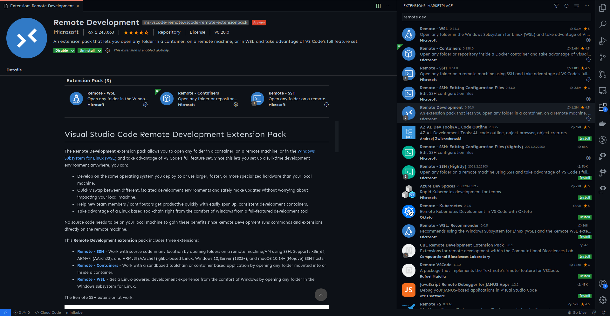
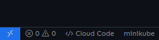
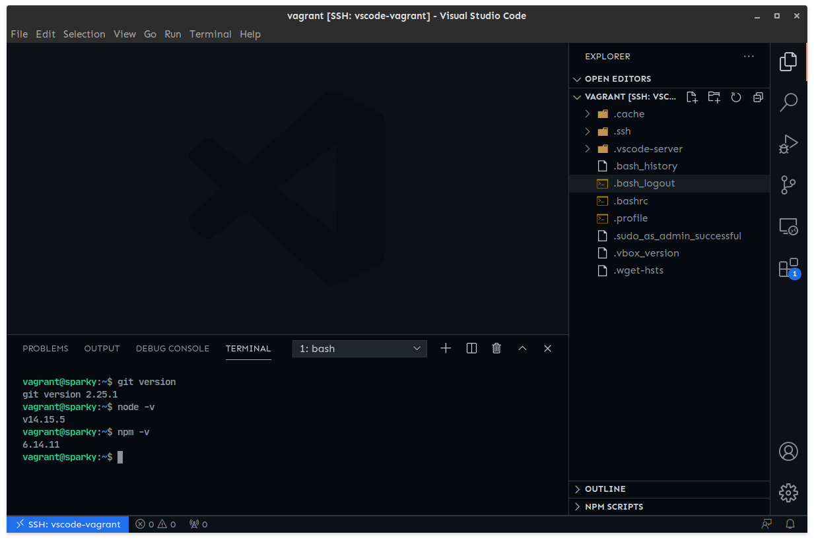

## Table of Contents

##

import Button from '~/components/Button.vue'

Dans ce tutoriel, nous allons mettre en place un environnement de développement avec NodeJS et y connecter notre éditeur de texte VsCode.

<Button :isGithub=true text="Code sur Github" link="hhttps://github.com/CorneilleEdi/loopbin-tutos/tree/main/vagrant-vscode"/>

Notre environnement de développement sera pour un projet nommé Sparky. Nous allons y développer un API pour le backend avec NodeJs,NPM, MongoDB, PM2 et NGINX (notre environnement de développement doit ressembler le plus possible à notre environnement de déploiement). Nous allons utiliser VsCode depuis notre machine. Pour cela il nous faudra connecter VSCode à la machine virtuelle en SSH pour y coder directement.

Allons y

## Les etapes

- Créer notre vagrantfile
- Vagrantfile : Configurer l'image
- Vagrantfile : Configurer le réseau
- Vagrantfile : Configurer les ressource de la machine virtuelle
- Vagrantfile : Configurer l'approvisionnement
  - Installer NodeJS
  - Installer et configurer PM2
  - Installer et configurer MongoDB
  - Installer et configurer NGINX
- Créer notre machine virtuelle
- Configurer le hostname sparky.dev sur notre machine pointant vers l'adresse ip de notre VM
- Installer les extensions requises pour VSCode
- Configurer la connection SSH
- Connecter VSCode

## Dossier et fichiers

Structure du dossier

```bash
.
├── scripts
│   ├── install_git.sh
│   ├── install_mongodb.sh
│   ├── install_nginx.sh
│   ├── install_nodejs.sh
│   └── update.sh
└── Vagrantfile
```

Voici notre Vagrantfile

```ruby:title=Vagrantfile
Vagrant.configure("2") do |config|
    config.vm.box_check_update = false

    config.vm.box = "peru/ubuntu-20.04-server-amd64"
    config.vm.hostname = "sparky"


    # Réseaux
    config.vm.network "private_network", ip: "192.168.100.10"

    # Fournisseur
    config.vm.provider "virtualbox" do |vb|
      vb.gui = false
      vb.memory = "1024"
      vb.cpus = 1
    end

    # Provision
    config.vm.provision "shell", path: "scripts/update.sh"
    config.vm.provision "shell", path: "scripts/install_nodejs.sh"
    config.vm.provision "shell", path: "scripts/install_git.sh"
    config.vm.provision "shell", path: "scripts/install_mongodb.sh"
    config.vm.provision "shell", path: "scripts/install_nginx.sh"
end
```

Script de mise à jour scripts/update.sh

```bash:title=scripts/update.sh
# Mise à jour
sudo apt-get update
sudo apt-get upgrade -y
```

Script d'installtion de git scripts/install_git.sh

```bash:title=scripts/install_git.sh
exists()
{
    command -v "$1" >/dev/null 2>&1
}

if exists git; then
    echo '==========> VERSION DE GIT <=========='
    git version
else
    # Installation de GIT
    echo '==========> INSTALLATION DE GIT <=========='
    sudo apt install git -y

    # Verification de l'installation de git
    echo '==========> VERSION DE GIT <=========='
    git version

    # Installation de Commitizen pour le formattage des messages de commit
    echo '==========> INSTALLTION DE COMMITIZEN <=========='
    sudo npm install -g commitizen
fi
```

## Explication du Vagrantfile

Dans ce cas, ce fichier est assez simple et très simple à comprendre. Essayons de comprendre les configurations dans ce fichier.

```bash
config.vm.box_check_update = false
```

Désactiver la vérification des mises à jour de l'image au lancement.

```bash
config.vm.box = "peru/ubuntu-20.04-server-amd64"
```

Sélectionne l'image `peru/ubuntu-20.04-server-amd64` comme box de base pour l'environnement virtuel.

```bash
config.vm.hostname = "sparky"
```

Configure le nom de la machine

```bash
config.vm.network "private_network", ip: "192.168.100.10"
```

Configuration d'une adresse IP statique

```bash
config.vm.provider "virtualbox" do |vb|
      vb.gui = false
      vb.memory = "1024"
      vb.cpus = 1
end
```

`v.gui = false` précise que nous ne voulions pas avoir l'interface de votre machine virtuelle ouverte au lancement.

`v.memory = 1024` spécifie la capacité de la mémoire RAM de notre VM à 1024MB soit 1GB.

`v.cpus = 1` précise le nombre de processeurs octroyés à ma machine.

```bash
config.vm.provision "shell", path: "scripts/update.sh"
config.vm.provision "shell", path: "scripts/install_nodejs.sh"
config.vm.provision "shell", path: "scripts/install_git.sh"
config.vm.provision "shell", path: "scripts/install_mongodb.sh"
config.vm.provision "shell", path: "scripts/install_nginx.sh"
```

spécifie les scripts à exécuter pour l'approvisionnement de la machine. Elles seront exécutées en ordre.

## Les scripts

Les scripts d'approvisionnement sont dans ce cas ecritent pour installer des logiciels et librairies comme Git, NodeJS et NGINX.

Maintenant que la configuration de machine est prête nous pouvons utiliser la commande `vagrant up` ou `vagrant up --provision` pour lancer notre machine.

## Configuration du hostname sparky.dev

Vu que nous avons spécifié une adresse ip static pour notre machine, il nous est possible de l'utiliser à chaque fois que nous cherchons à contacter la machine virtuelle. Le seul problème est qu'il n'est pas facile de se rappeler de cette adresse ip chaque fois, spécialement si on a plusieurs environnements de développement.

Il est possible de rattacher un nom (hostname/nom de domaine) a cette adresse ip sur notre machine.

Imaginer cette approche comme un enregistrement DNS.

Pour cela, il va falloir ajouter une configuration à un fichier spécial

- Windows 10 – “C:\Windows\System32\drivers\etc\hosts”
- Linux – “/etc/hosts”
- Mac OS X – “/private/etc/hosts”

Il suffit d'ajouter la ligne suivante dans le fichier

```bash
192.168.100.10 sparky.dev www.sparky.dev
```

Vu que NGINX a été installé dans la machine virtuelle, nous pouvons accéder à la page par défaut de NGINX en retrant l'addresse ip `192.168.100.10` ou un des nom de domaine configurer : `[sparky.dev](http://sparky.dev)` ou `www.sparky.dev`.

## Connecter VSCode

Visual Studio Code est un éditeur de code source léger mais puissant qui s'exécute sur votre bureau et est disponible pour Windows, MacOS et Linux. Il est livré avec un support intégré pour JavaScript, TypeScript et Node.js et dispose d'un riche écosystème d'extensions pour d'autres langages (tels que C ++, C #, Java, Python, PHP et Go) et des environnements d'exécution (tels que .Net et Unité).

Une suite d'extension de VSCode développée par Microsoft permet de connecter l'éditeur de texte à un environnement par SSH. Il s'agit de l'extension `Remote Development`

[https://marketplace.visualstudio.com/items?itemName=ms-vscode-remote.vscode-remote-extensionpack](https://marketplace.visualstudio.com/items?itemName=ms-vscode-remote.vscode-remote-extensionpack)



Une fois l'extension installée, il faudra configurer la connexion SSH. Il existe plusieurs méthodes mais la plus simple est celle qui consiste à ajouter les paramètres de connexion dans le fichier de configuration SSH. Pour cela il va falloir que nous récupérions ces paramètres avec la commande `vagrant ssh-config`

```bash
Host vscode-vagrant
  HostName 127.0.0.1
  User vagrant
  Port 2222
  UserKnownHostsFile /dev/null
  StrictHostKeyChecking no
  PasswordAuthentication no
  IdentityFile /home/corneilledi/vms/vscode-workshop/.vagrant/machines/default/virtualbox/private_key
  IdentitiesOnly yes
  LogLevel FATAL
```

La location du fichier de configuration SSH diffère par rapport au système d'exploitation

- Linux : ~/.ssh/config et /etc/ssh/ssh_config
- Windows : C:\Users\username\.ssh\config

Il suffit d'y ajouter les configurations récupérées grâce à la commande `vagrant ssh-config` .

Vous pouvez lancer la connexion ssh avec le nouveau bouton ajouter par l'extension remote en bas de l'éditeur.



Choisissez l'option `Se connecter` , puis choisissez votre fichier de configuration ssh et le Host auquel vous vouliez vous connecter.

Un avantage est que VSCode se connecte avec l'utilisateur vagrant qui a les permissions root. Cela évitera tout problème de permissions.

## Resultat



Notre éditeur est connecté et prêt.
